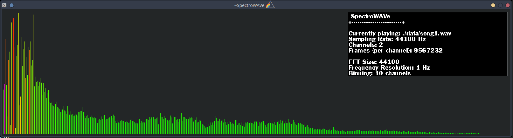

# SpectroWAVe



SpectroWAVe is visualizer of the accumulated spectral magnitudes
across the different frequency components of a signal.

It can read signal from files in the WAV format.
WAV format was intially choosed because this file format stores data uncompressed
and because it gave the tool a cool name.

SpectroWAVe is powered by CUDA (cuFFT) and SDL2.

Enjoy! :)


## How to compile

**Dependencies:**
  - CUDA Development Kit (v10.1)
  - libsndfile1-dev (1.0.28)
  - libsdl2-dev (2.0.10)
  - libsdl2-mixer-dev (2.0.4)
  - libsdl2-ttf-dev (2.0.15)

  
Guessing you have all the dependencies installed through system package manager (e.g. apt). You may run:

```
make all
```

## How to execute

```
#./build/executable <filepath> <fftSize> <binning> 
./build/executable ./data/song1.wav 1024 2

```

Or alternative,

```
make exec FILE=./data/song1.wav BINNING=2 FFTSIZE=1024

```


## Project Structure

```
.
├── data              // Input signals.
├── include           // Header files.
├── lib               // External libs (not writting by me).
├── Makefile          
├── README.md
├── resources         // Fonts, etc..
├── src               // Source files.
└── test              // This are not source code test,
                      // rather little experiments I had to do to test functionallity 
                      // separated from source code during the development of project.

```
